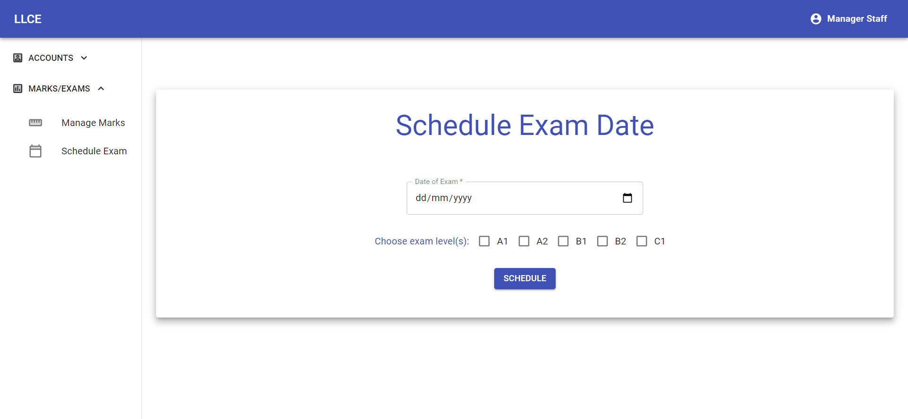
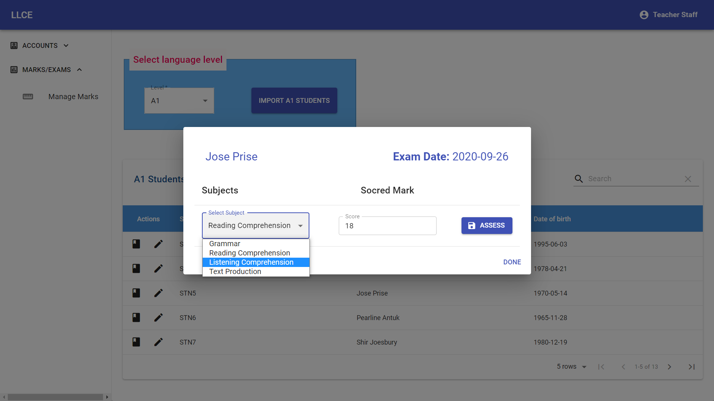

# Language-Center-Grade-Management-App


## Introduction

This application represents  a system used to manage students grades  in a language learning center. Principally two goals were aimed for: (i) Providing  a platform for teachers where they can reliably record their students assessments results, (ii) Providing a platform for the students to easily access their individual results.  In the process of making an application that will respond to the requirements, I decided to propose a web application solution. In summary the system runs a Spring-Boot and MySQL powered back end and a react front end  application.


## Application

As mentioned earlier the application is a system used to manage students grade in a language center. The app UI can be operated over browsers using various devices such as pc, smartphones, tablets etc. The back end provides a series of REST APIs to enable the dynamic aspect of the front end work. The system has two groups of actors the students and the staff. The staff group is further subdivided into three: admin, manager and teacher.  This is clearly shown on the table below:

1. Student user

2. Staff user

   Admin

   Manager

   Teacher

The admin user can access the application using the previously stated devices and can perform the following actions:

1. Login / Logout
2. Create a new user account 
3. See all the users account details except the password
4. See all student marks

The manager user can perform the following actions:

1. As the admin user he/she can perform actions 1,3 and 4.
2. Schedule exams

The teacher user can perform the following actions:

1. Login / Logout 
2. Assess the students individually
3. See all students marks
4. Should be able to modify students marks. Only marks they had previously given can they modify  (not yet implemented)
5. See all students accounts details except password

The student user can perform the following actions:

1. Login / Logout 
2. See their marks 

All the users should be able to change their password.(not yet implemented).


The back end provides a REST API made up of various end points. It should be noted that  all the end points are secured with a Jason Web Token (JWT) except for one end point, the login end point.


## Database Schema

The current schema looks as follows:


- The authentication and authorization is governed by the credential and role Tables.
- The staff table keeps details about the staff users
- The student table keeps the data about all student users in the system.
- The mark table keeps all the marks given to the students based on the subject and the exam session.  For each mark the teacher who attributed the mark is known and the student who received the mark is also known as well as the subject and the exam session.


## Technology

- **Spring Boot** - Server side framework

- **MySQL** - SQL database

- **JWT** - Authentication mechanism for REST APIs

- **React**  - Front end JavaScript framework

- **Material-UI** - React component library

- **Docker** - Containerizing framework (will be used for local deployment)

  

<h2> <a href="https://llce.herokuapp.com/">Live Demo</a></h2>

### Demo Credentials

| Role    | Username         | Password |
| ------- | ---------------- | -------- |
| admin   | admin.staff      | admin    |
| manager | manager.staff    | manager  |
| teacher | teacher.staff    | teacher  |
| student | student.students | student  |


## Running the server locally

To be able to run the server application, you will first need to built the server project. For this you will need to have Java SDK, Apache Maven and MySQL install on your computer. The least required versions are listed below:

- Apache Maven 3.6.1
- Java 8
- MySQL 8.0.19

In case all the requirements are fulfilled you can get the project file from this repos: `github.com/rodrigue-tchuensu/Language-Center-Grade-Management-App` by typing the following command:

```
git clone -b soringboot-server git@github.com:rodrigue-tchuensu/Language-Center-Grade-Management-App.git
```

Open a command line at the base of the project fold an run the following maven command to build the project 

```
mvn clean install
```

After  successfully building the project, you have two options to run the server, either:

You run the jar generated from the build 

```
java -jar target/GradeManagementServer-0.0.1-SNAPSHOT.jar
```

You can also use the Maven plugin to run the app as follows

```
mvn spring-boot:run 
```

You can follow any/all of the above commands, or simply use the run configuration provided by your favorite IDE and run/debug the app from there for development purposes. Once the server is setup you should be able to access the REST APIs  over the following base-path:  [http://localhost:9090/api](http://localhost:9090/api/)

An important api endpoint is the login endpoint `http://localhost:9090/api/login`. Each every user must use this endpoint to authenticate themselves in other to obtain a JWT which will grant them the authorization to some of the other endpoints.


## Running the front end application locally

To build and/or run the UI app you need to install Nodejs on your computer. The least require version is `Node 12.13.1`. You can get the UI project files from this repos by running the following command 

```
git clone -b react-gui git@github.com:rodrigue-tchuensu/Language-Center-Grade-Management-App.git
```

Running the following command 

```
npm start 
```

at the base of project directory will launch building the application as well as starting it. Once the UI app is started, it can be accessed using the following URL:  http://localhost:3000


## Deploying the entire system using Docker


## User Interface

Here are the various screens you should be able to use once the application is setup properly.    The various screens are accessible based on the type of user log in.

<p align="center">
    <b>Login</b><br>
    <br>
    
</p>


<p align="center">
    <b>Accounts Overview</b><br>
    <br>
    
</p>


<p align="center">
    <b>Create new Account</b><br>
    <br>
    
</p>


<p align="center">
    <b>Schedule Exams</b><br>
    <br>
    
</p>


<p align="center">
    <b>Manage Marks (a) </b><br>
    <br>
    
</p>


<p align="center">
    <b>Manage Marks (b) </b><br>
    <br>
    
</p>


<p align="center">
    <b>Student Page</b><br>
    <br>
    
</p>


## Contributors

Rodrigue Tchuensu Pouopse 


## License

This project is licensed under the terms of the MIT license.


## Credit 

  Image source:  https://images.app.goo.gl/GVfAtDhD2wsu6opD7

 image source:  image source: https://images.app.goo.gl/BypGX5hern4BgqNU7 